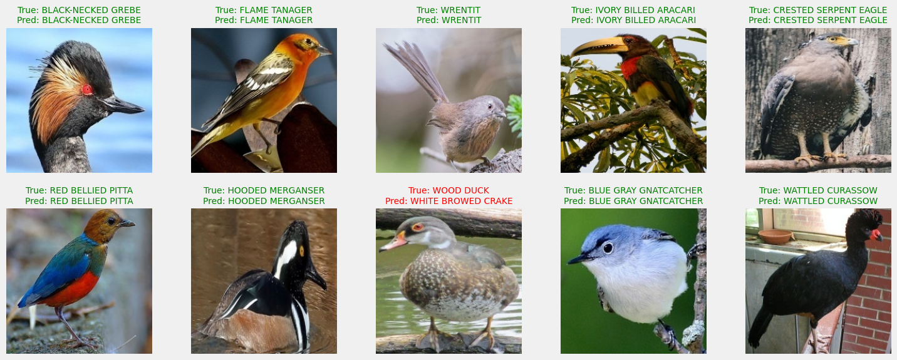
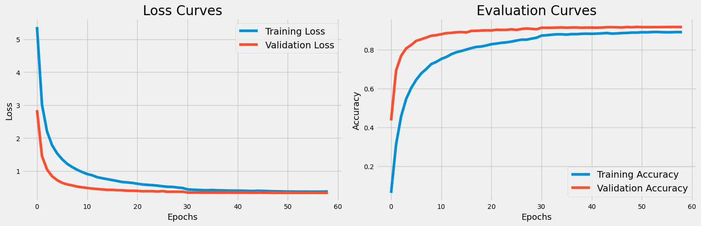
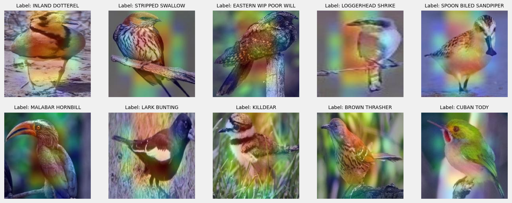

# Feather Pal 🕊️

## Project Overview

This project focuses on building a robust deep learning model for bird species classification using TensorFlow and the EfficientNetB0 architecture. The dataset consists of a diverse collection of bird images, and the goal is to train a model that accurately identifies and classifies different bird species.

## Project Demo






## Dataset Information

The dataset is loaded from a CSV file named 'birds.csv', encompassing essential details such as class ID, file paths, labels, data sets, and scientific names. The dataset, comprising 89,885 entries and 5 columns, is meticulously divided into training (84,635 entries), validation (2,625 entries), and testing (2,625 entries) sets.

## Data Preprocessing and Augmentation

The dataset undergoes a thorough preprocessing phase, including a split into training and testing sets using the train_test_split function. ImageDataGenerators are employed for efficient data augmentation and loading during training and testing. Augmentation techniques, such as resizing, rescaling, flipping, rotation, zooming, and contrast adjustments, are applied to enhance model generalization.

## Model Architecture

The project leverages the power of the EfficientNetB0 model, pretrained on ImageNet, as the backbone architecture. The last layers are fine-tuned to suit the specific task of bird species classification. Additional dense layers, incorporating dropout for regularization, are added for further model complexity. The model concludes with a softmax activation layer, offering 524 nodes corresponding to the unique bird species in the dataset.
Training and Evaluation. The model is compiled using the Adam optimizer, categorical crossentropy loss, and accuracy as the evaluation metric. Training spans 150 epochs, featuring early stopping, learning rate reduction on plateau, and TensorBoard logging as integral callbacks. The model's performance is evaluated on the testing set, showcasing test loss and accuracy metrics.

## Model Evaluation

The project includes GradCAM (Gradient-weighted Class Activation Mapping) for visualizing the regions of an image that contribute most to the model's predictions. This interpretable visualization aids in understanding the model's decision-making process.

### Classification Report

A detailed classification report is generated, presenting precision, recall, F1-score, and support for each class. Uncommenting a line in the code allows for saving the report as 'classification_report.csv'.

### GradCAM Visualization of Predictions

A set of images from the testing set is chosen randomly to showcase the GradCAM visualizations. This provides insights into the regions of the images influencing the model's predictions.

## Project Structure
```
.
|-- FeatherPal.h5
|-- FeatherPal_EFFNETB0.ipynb
|-- README.md
`-- images
    |-- GradCAM.png
    |-- ModelEvaluation.png
    `-- TrainingCurves.png

2 directories, 6 files
```

## Conclusion

This comprehensive project demonstrates the end-to-end process of building a sophisticated bird species classification model. From data loading and preprocessing to model architecture, training, evaluation, and interpretability, the README serves as a guide for understanding and reproducing the results.
